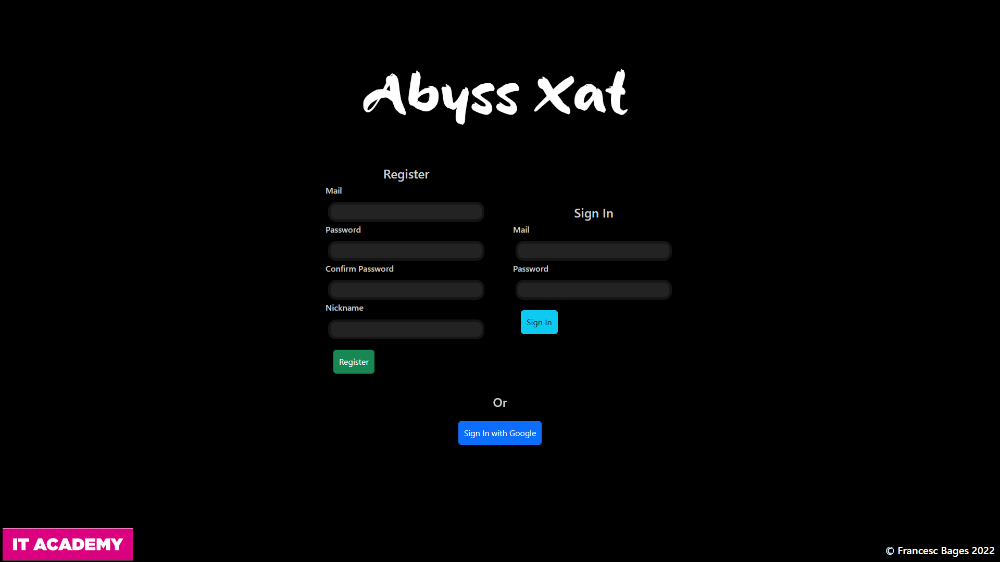
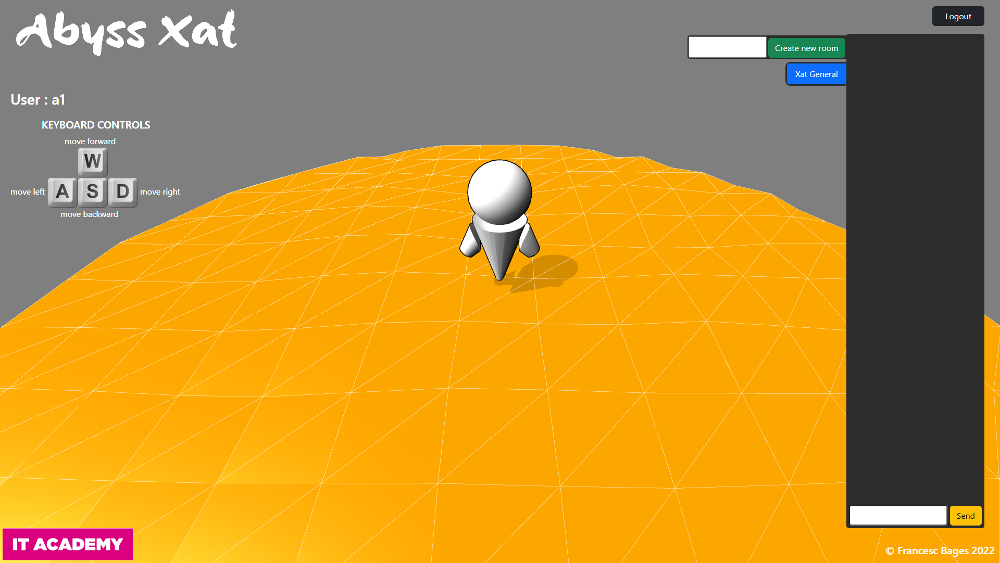

# Sprint 5.1: XAT

##  🏐 Descripció del Projecte

Projecte full stack MEAN, MongoDB Express Angular i NodeJS, es basa en la realitza un xat on cada usuari es representat per un avatar en un entorn 3D. Els usuaris poden generar sales públiques i privades.

## 👇 Instruccions d'ús
### Instal.lació
1 - Clona el repo de Github
 
````  
https://github.com/fbages/nodeInitialDemo/tree/5.1---Xat
````

2 - Descarregar les dependències necessàries via NPM a la carpeta del backend:
````
cd backend
npm i
````

3 - Per executar el backend (REST API en localhost:3000):
````
npm start
````

4 - Descarregar les dependències necessàries via NPM a la carpeta del frontend:
````
cd frontend
npm i
````

5 - Per executar el frontend (localhost:4200):
````
npm start
````

## URL del frontend
http://localhost:4200


## Screenshots

# Landing page



# Entorn 3D amb xat

